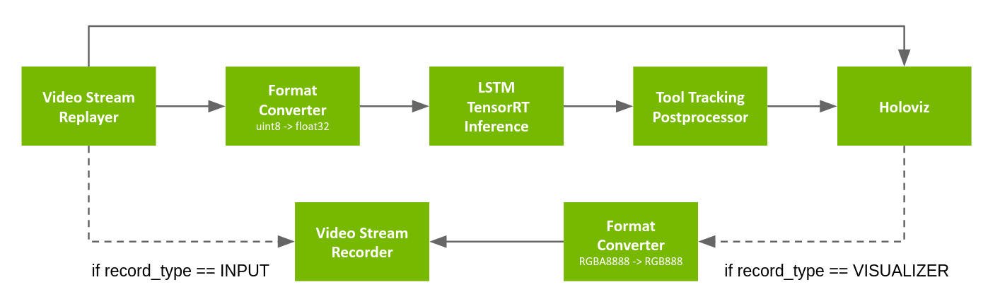

## Endoscopy Tool Tracking Application with VTK

Digital endoscopy is a key technology for medical screenings and minimally invasive surgeries. Using real-time AI workflows to process and analyze the video signal produced by the endoscopic camera, this technology helps medical professionals with anomaly detection and measurements, image enhancements, alerts, and analytics.


<br>
Fig. 1 Endoscopy (laparoscopy) image from a cholecystectomy (gallbladder removal surgery) showing AI-powered frame-by-frame tool identification and tracking. Image courtesy of Research Group Camma, IHU Strasbourg and the University of Strasbourg ([NGC Resource](https://catalog.ngc.nvidia.com/orgs/nvidia/teams/clara-holoscan/resources/holoscan_endoscopy_sample_data))


The Endoscopy tool tracking application provides an example of how an endoscopy data stream can be captured and processed using the C++ or Python APIs on multiple hardware platforms.

### How to build this.

You need to create a docker image which includes VTK with the provided `vtk.Dockerfile`:

```bash
docker build -t vtk:latest -f vtk.Dockerfile .
```

Then, you can build the tool tracking application with the provided `Dockerfile`:

```bash
./dev_container launch --img vtk:latest
```

Inside the container you can build the holohub suite with:

```bash
./run setup
./run build
```
Now you can run the tool tracking application with:

```bash
./run launch endoscopy_tool_tracking_vtk cpp
```

### Video Stream Replayer Input
<br>
Fig. 2 Tool tracking application workflow with replay from file


The pipeline uses a recorded endoscopy video file (generated by `convert_video_to_gxf_entities` script) for input frames. Each input frame in the file is loaded by [Video Stream Replayer](https://docs.nvidia.com/clara-holoscan/sdk-user-guide/holoscan_operators_extensions.html#operators) and passed to the following two branches:
- In the first branch, the input frames are directly passed to [Holoviz](https://docs.nvidia.com/clara-holoscan/sdk-user-guide/holoscan_operators_extensions.html#operators) for rendering in the background.
- In the second branch, the frames go through the [Format Converter](https://docs.nvidia.com/clara-holoscan/sdk-user-guide/holoscan_operators_extensions.html#operators) to convert the data type of the image from `uint8` to `float32` before it is fed to the tool tracking model (with [Custom TensorRT Inference](https://docs.nvidia.com/clara-holoscan/sdk-user-guide/holoscan_operators_extensions.html#operators)). The result is then ingested by the [Tool Tracking Postprocessor](https://docs.nvidia.com/clara-holoscan/sdk-user-guide/holoscan_operators_extensions.html#operators) which extracts the masks, points, and text from the inference output, before [Holoviz](https://docs.nvidia.com/clara-holoscan/sdk-user-guide/holoscan_operators_extensions.html#operators) renders them as overlays.

The pipeline graph also defines an optional [Video Stream Recorder](https://docs.nvidia.com/clara-holoscan/sdk-user-guide/holoscan_operators_extensions.html#stream-playback) that can be enabled to record the original video stream to disk (`record_type: 'input'`), or the final render by Holoviz (`record_type: 'visualizer'`) after going from `RGBA8888` to `RGB888` using a [Format Converter](https://docs.nvidia.com/clara-holoscan/sdk-user-guide/holoscan_operators_extensions.html#operators). Recording is disabled by default (`record_type: 'none'`) in order to maximize performance.


### VTK annotations and rendering

The tool tracking application uses the [VTK](https://vtk.org/) library to render the tool tracking results on top of the endoscopy video frames. The VTK library is a powerful open-source software system for 3D computer graphics, image processing, and visualization. The VTK library provides a wide range of functionalities for rendering, including 2D and 3D graphics, image processing, and visualization. The tool tracking application uses VTK to render the tool tracking results on top of the endoscopy video frames. The tool tracking results include the tool masks, tool points, and tool text. The tool masks are rendered as colored polygons on top of the endoscopy video frames. The tool points are rendered as colored spheres on top of the endoscopy video frames. The tool text is rendered as colored text on top of the endoscopy video frames. The tool tracking application uses the VTK library to render the tool tracking results on top of the endoscopy video frames. The tool tracking results include the tool masks, tool points, and tool text. The tool masks are rendered as colored polygons on top of the endoscopy video frames. The tool points are rendered as colored spheres on top of the endoscopy video frames. The tool text is rendered as colored text on top of the endoscopy video frames. The tool tracking application uses the VTK library to render the tool tracking results on top of the endoscopy video frames. The tool tracking results include the tool masks, tool points, and tool text. The tool masks are rendered as colored polygons on top of the endoscopy video frames. The tool points are rendered as colored spheres on top of the endoscopy video frames. The tool text is rendered as colored text on top of the endoscopy video frames. The tool tracking application uses the VTK library to render the tool tracking results on top of the endoscopy video frames. The tool tracking results include the tool masks, tool points, and tool text. The tool masks are rendered as colored polygons on top of the endoscopy video frames. The tool points are rendered as colored spheres on top of the endoscopy video frames. The tool text is rendered as colored text on top of the endoscopy video frames. The tool tracking application uses the VTK library to render the tool tracking results on top of the endoscopy video frames. The tool tracking results include the tool masks, tool points
